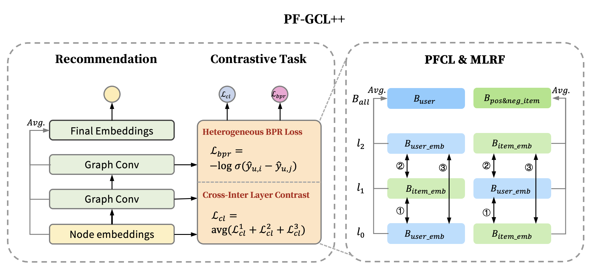

# PF-GCL++: Preference-Fusion Graph Contrastive Learning for Recommendation



## Overview

PF-GCL++ is a PyTorch-based recommendation framework that implements and extends the Preference-Fusion Graph Contrastive Learning approach for recommendation systems. This framework is built on top of [RecBole](https://github.com/RUCAIBox/RecBole), a unified, comprehensive, and efficient recommendation library.

PF-GCL++ focuses on enhancing recommendation quality by applying state-of-the-art graph contrastive learning techniques to user-item interaction graphs. The main contribution of this framework is our novel Preference-Fusion Graph Contrastive Learning (PF-GCL) model, which effectively integrates multiple preference signals to generate high-quality recommendations.

## Requirements

To use PF-GCL++, ensure you have the following dependencies installed:

```
python>=3.7.0
torch>=1.7.0
numpy>=1.17.2
scipy>=1.6.0
recbole>=1.0.0
torch_geometric>=2.0.0
```

## Quick Start

### Training a model

You can quickly train a model using the following command:

```bash
python run_recbole_gnn.py --model=[model_name] --dataset=[dataset_name] --config_files=[config_files_path]
```

For example, to train PF-GCL on the amazon-books dataset:

```bash
python run_recbole_gnn.py --model=PFGCL --dataset=amazon-books
```

For hyperparameter tuning, you can use:

```bash
python run_hyper.py --model=[model_name] --dataset=[dataset_name] --config_files=[config_files_path]
```

## Datasets

PF-GCL++ primarily focuses on three widely-used benchmark datasets for recommendation tasks:

| **Dataset** | **#User** | **#Item** | **#Interactions** | **Density** |
|-------------|-----------|-----------|-------------------|-------------|
| Yelp        | 27,821    | 19,005    | 1,009,140         | 0.00190     |
| Kindle      | 60,469    | 57,213    | 880,859           | 0.00025     |
| Amazon-Book | 58,145    | 58,052    | 2,517,437         | 0.00075     |

*Note: Yelp refers to the Yelp2018 dataset. Kindle refers to Amazon-Kindle-Store.*

### Data Processing

For all datasets, we applied the following preprocessing steps:
- For Yelp2018, we filtered out users and items with fewer than 15 interactions
- For Amazon-Kindle-Store, we filtered out users and items with fewer than 5 interactions
- For Amazon-Book, we filtered out users and items with fewer than 15 interactions
- For all datasets, we only kept interactions with ratings ≥ 3 (on a 1-5 scale) as positive feedback
- The datasets were split into training, validation, and testing sets


## Experimental Results

We conducted extensive experiments on three benchmark datasets: Yelp, Amazon-Kindle-Store, and Amazon-Book. Our results demonstrate that PF-GCL++ consistently outperforms state-of-the-art recommendation methods.

### Performance Comparison

| **Dataset** | **Metric** | **PF-GCL++** | 
|-------------|------------|--------------|
| **Yelp**    | Recall@10  | **0.1136**   |
|             | NDCG@10    | **0.0845**   | 
| **Kindle**  | Recall@10  | **0.1929**   | 
|             | NDCG@10    | **0.1251**   | 
| **Books**   | Recall@10  | **0.1151**   | 
|             | NDCG@10    | **0.0859**   | 

*Note: Kindle refers to Amazon-Kindle-Store and Books refers to Amazon-Book datasets. The improvement percentages are calculated based on the best baseline performance. Statistical significance (p < 0.01) was confirmed through paired t-tests.*

## Extending PF-GCL++

To implement a new model:

1. Add your model class in `recbole_gnn/model/general_recommender/`
2. Register the model in `recbole_gnn/model/general_recommender/__init__.py`
3. Add model configurations in `recbole_gnn/properties/model/`

## Acknowledgement

This project is built upon [RecBole](https://github.com/RUCAIBox/RecBole), a unified recommendation framework. We thank the RecBole team for their excellent work.

## License

This project is licensed under the terms of the license included in the repository.
